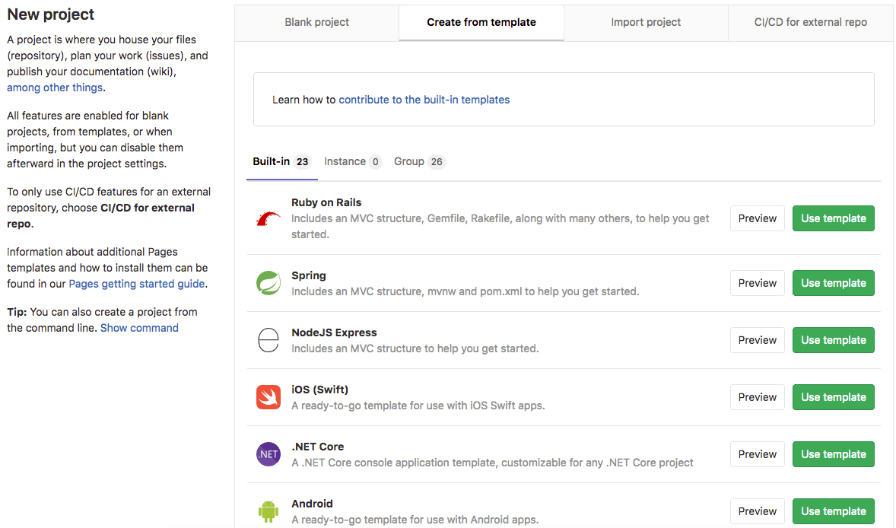

# Create a Pages website from a template **(FREE)**

GitLab provides templates for the most popular Static Site Generators (SSGs).
You can create a new project from a template and run the CI/CD pipeline to generate a Pages website.

Use a template when you want to test GitLab Pages or start a new project that's already
configured to generate a Pages site.

1. From the top navigation, select the **+** button and select **New project**.
1. Select **Create from Template**.
1. Next to one of the templates starting with **Pages**, select **Use template**.

   

1. Complete the form and select **Create project**.
1. From the left sidebar, navigate to your project's **CI/CD > Pipelines**
   and select **Run pipeline** to trigger GitLab CI/CD to build and deploy your
   site.

When the pipeline is finished, go to **Settings > Pages** to find the link to
your Pages website.

For every change pushed to your repository, GitLab CI/CD runs a new pipeline
that immediately publishes your changes to the Pages site.

To view the HTMl and other assets that were created for the site,
go to the **Pipelines** tab, view the job, and on the right side,
select **Download artifacts**.
